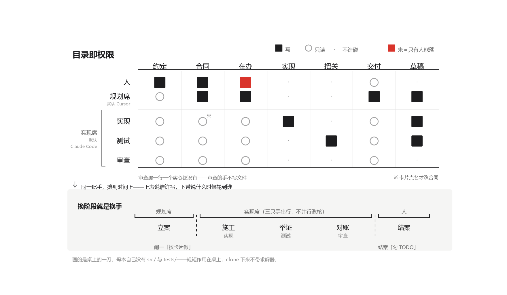

<p align="center">
  
</p>

<h1 align="center">Dossier</h1>

<p align="center">
  <b>一次一刀，盖章才算数。</b>
</p>

<p align="center"><i>English? See <a href="README.en.md">README.en.md</a>.</i></p>

---

**Dossier 是一套给 AI 编程代理用的流程约束和 harness 配置。** 以 git submodule 挂进你的仓库，跑一次 `init`，它在你的仓库根上铺出 `docs/` 骨架、`CLAUDE.md` / `AGENTS.md` 和几份角色文件。从那以后代理按它的规矩干活：一次只做一张卡上的事；写卡和改代码是两个会话；验收判据先写下来再跑；说「通过」必须指得出能复现的证据。

**给谁用**：你让代理写的代码，测试全绿也不等于对——数值求解器、数据管线、任何交付物是「一个结论」而不是「一个能跑的东西」的项目。
**不给谁用**：失败很响的项目。编译不过、页面白屏、用户当场就能发现——这套密度在那里是税，不是保险。

```text
your-repo/
  CLAUDE.md  AGENTS.md        代理每次开工先读的约定
  .claude/   .cursor/         角色文件、开关
  docs/
    TODO.md  SESSION.md       待办；本刀的运行态
    cmd/  design/  reports/   每刀的卡；合同层；阶段交付
  dossier/                    子模块。母本本身，你不改它
```

安装两步：

```text
git submodule add https://github.com/YFG-tec/Dossier dossier
python dossier/docs_meta/src/init.py
```

细则往下读；只想装，看这两行就够。

## 绘卷

一叠卷宗，一次抽一份出来办。背上贴着签，不翻开就知道是哪一件。
办完盖章，盖了才算数；章不是自己盖给自己的。抽走一份，叠还在。

项目中文名是「绘卷」，英文名是 `Dossier`，名词是案卷。都是「卷」：案卷是背上贴着签的一捆（不翻开就知道是哪一件），绘卷是展开给你看的一幅（画的就是那一叠）。

| 词 | 指什么 |
|---|---|
| **Dossier** | 本仓库。这套规矩本身 |
| **桌** | 课题仓库 |
| **刀** | 桌上的一个工作单元 |

**母本只有一份，桌一张张从它出来。**

这套东西是几个数值项目里边做边收的。各桌有各自的实现和探索路径。Dossier 做的不是汇编，是**提取、统合、抽象、升级**：单桌没想到的缺口要补，不利于管理的冗余要丢掉。三桌里有的，不自动进公共层。旧桌没有义务回改。对照表见 `docs_meta/src/sources.md`。

---

## 公信

分档判据是「判据外生还是内生」，不是「项目大小」。判据外生的（有参考实现、金标准）该长跑、稀疏监督；判据内生的（自己造）该短刀、密集闸门。这套东西在前一格是税，在后一格是本体。

第二条分野是失败响不响。编译不过、对不上参考输出是响的；数值上的静默降档（枚举声明三档、内核当默认档、契约测试全绿）是不响的。**密集闸门买的不是速度，是让静默失败在一刀之内暴露。** 这条辩护不能是「模型还不够好」，只能是「判据内生 + 失败静默」这两条；哪天这两条不成立了，就该往长跑退，而不是加规矩。

这份管理密度，人类项目负担不起。它在这里成立，是因为**执行规矩的边际成本降到了近乎为零**：写卡、落盘、逐条对账，对智能体是顺手；文档是它唯一稳定的记忆。规矩定得细不是因为聪明，是因为现在定得起。

判据先声明、证据能复现、盖章的手不是干活的手。核心不是转化，是取信——不是把原料变成产品，是让一个结论**可以被相信**。

偏离要逐条写明代价，藏起来的偏离自己就是一类失败。欠的账摊在 `docs_meta/docs/todo.md` 第 5 章、第 6 章。怎么立的，见下一节。

---

## 建制

这套东西的骨架是五条：**两席、两闸、卡、权威分层、状态在磁盘。**

三样挂进这五条：派专职的手、举证独立复跑，挂在「两席」底下；记录只追加，挂在「状态在磁盘」底下；源码 → 产物单向，挂在「权威分层」底下——只准源码 → 产物，要改就去改源码那一头；两边不一致不是判据，方向才是。

**两席**不是两个 AI 一起写代码。分工是能力差异加上权限差异。选哪个 harness 坐哪一席可以换，**两席必须是两个会话**不能换。角色不是人设，是**写权限 + 失败时许做什么**。

- 写卡的手不接着改核
- 改核的手不改测试口径
- 写测试的手不把核修到绿
- 审查的手不写文件；只核对结果和预先声明的标准
- 规划席说「继续推进」打不开 `src/`

**两闸**是立案一道、结案一道。人只站两道闸。

**卡**是这一刀唯一的许可面。一刀一张卡，没有卡片不准动核。

**权威分层**：源码是规范正文，产物是编出来的 harness。

**状态在磁盘**：状态记录在版本控制里落盘，能复现，不在聊天里漂移。

防的是七类失败：

1. **超售。** 用户要一行验证，它顺手开下一阶段。
2. **状态在聊天里。** 换窗口，范围漂移。
3. **规划席和实现席抢同一份核。**
4. **探针对不上复现。** 报告引用 `.tmp/run_*.py`，交付第二天废。
5. **测试不能失败。** 期望值和计算值同源。
6. **散了先改数值旋钮。** 病状没了，合同被换掉。
7. **图没人看。** 真错误只在打开图时才露。

**先用目录把权威分开，再用一刀把范围锁死。范围、合同、证据、许可都落到磁盘上。**

<p align="center">
  
</p>

装这套东西是两个动作：把母本挂成子模块，再跑一次 `init`。

```text
1. git submodule add https://github.com/YFG-tec/Dossier dossier
2. python dossier/docs_meta/src/init.py
```

子模块目录叫什么随你，`init` 按自己的位置现算路径。它默认铺到子模块外面一层，也就是你这个仓库的根上。铺出来的是一副空壳，不是样例——目录和落点都在，内容要你自己写。根上那几份 harness 是从母本 `.mirror/` 拷出来的。

重跑只补缺的那几件，已经有的一律不覆盖，所以升级也是这条路：`git submodule update --remote` 拉新版，再跑一次 `init`。边界是物理的——子模块目录里面归母本，外面全归你这张桌。

细则按需要打开，不必先读完：

| 要干什么 | 读 |
|---|---|
| 目录长什么样、图放哪 | `docs_meta/src/directory.md` |
| 一刀、卡片、收口 | `docs_meta/src/workflow.md` |
| 验证、排障 | `docs_meta/src/verify.md` |
| 角色、档位 | `docs_meta/src/roles.md` |
| Claude Code 怎么落 | `docs_meta/src/claude-code.md` |
| Cursor 怎么落 | `docs_meta/src/cursor.md` |
| 外面有什么、为什么不那样做 | `docs_meta/src/sources.md` |
| 还没对齐的问题 | `docs_meta/docs/design/open.md` |

---

## 那枚爪印

写代码的速度，人早就追不上大模型了；但最后落下的那一爪，才是灵魂。
